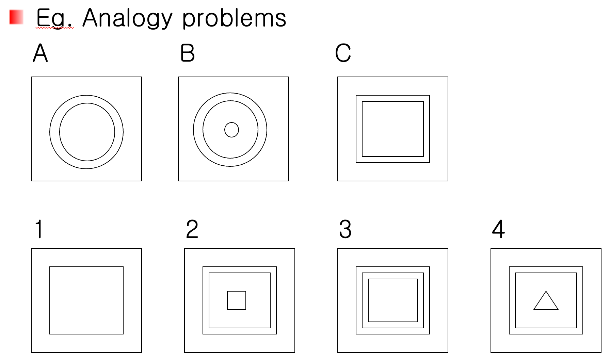
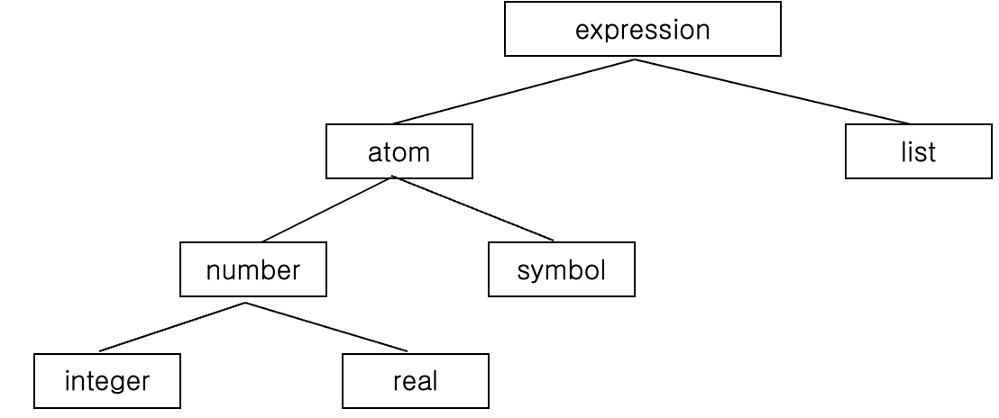

<h1>AI (Artificial Intelligence)</h1>

<h2>Professor I.J Chung</h2>

<h3>AI(Articial Intelligence)</h3>

- Study of mental thinking & facilites with appropriate computational models
- Solve the real world problems (see below).

<h3>Fundamental assumption of AI : </h3>

- What the brain of human beings may be thought of at some level as a kind of computations.

<h3>Another definition of AI</h3>

- One of major fields of computer science that makes it possible to perceive, think, reason and act.
- Cognitive science, psychology

<h3>AI</h3>

- Emphasis an computation, reasoning, action, etc.
- Task domain of AI
    - mundane tasks
        - Perception : vision, speech
        - Natural language processing(NLP)
            - understanding, generation, translations, semantic modeling.
        - Common sense reasoning
        - Robot control

<h3>Formal tasks</h3>

- Automated reasoning with formal logic
- Game : chess, go, tic-tac-toe, etc.
- Mathematics
    - geometry, logic, calculus, proving properties of programs

<h3>Expert tasks</h3>

- Engineering
    - design, fault findings, manufacturing, planning
- Scientific analysis :
- Medical diagnosis & analysis
- Financial analysis & planning

<h3>Machine learning</h3>

- symbol-based
<br>: ID3 (decision tree), inductive bias, COBWEB, explanation-based learning
- Connectionist
<br>: artificial neural networks
- Social based
<br>: genetic algorithm (Darwinism with competition)
- Emergent : agent
---
<h3>Eg. Analogy problems</h3>



---

<h3>AI language</h3>

- LISP (functional declarative language)
- Prolog (logic declarative language)

<h3>LISP</h3>

- Flexible language for symbolic manipulation rather than numeric computations
- Functional programming language based on λ - expression (McCarthy, of MIT 1965)
- Interpreted language as opposed to compiled language
- Widely used in ES/KBS, reasoning & learning, NLP, etc.
- cf: Prolog (logic programming lang.)

<h3>Basic Lisp Primitives</h3>

- Atom: fundamental objects in LISP without parenthesis(괄호)
    - Eg. OK 3 1.6 |
- List : collection of atom enclosed by parenthesis (nesting is allowed)
    - (I AM A BOY) (I (LOVE) YOU) (1.5)
- Operator : arguments with lists (prefix notation) - 전위 표기법
    - (+ 4 2) (* 6 3)
    - (/ (+ 4 2) (* 6 3))
- Procedure : basic program unit in LISP
- Primitive : procedure supplied by LISP itself
- Program : collection of procedures to solve a particular job
<br>

<br>
---
<h3>CAR & CDR</h3>

예제 1)

- (CAR `(I AM A BOY))
    <br>I
    - (ChatGPT o1-preview 분석)
        - Step 1 : 리스트 생성
            - `(I AM A BOY)는 리스트 (I AM A BOY)를 그대로 사용하겠다는 의미입니다.
            - 즉, 리스트는 (I AM A BOY)입니다.
        - Step 2 : CAR 함수 적용
            - CAR는 리스트의 첫 번째 요소를 반환합니다.
            - 리스트 (I AM A BOY)의 첫 번째 요소는 I입니다.
        - 결과
            - I

예제 2)

- (CAR `((I) AM A BOY))
    <br>(I)
    - (ChatGPT o1-preview 분석)
        - Step 1 : 리스트 생성
            - 리스트는 ( (A B) C)입니다.
            - 첫 번째 요소는 (A B)입니다.
        - Step 2 : CAR 함수 적용
            - 리스트의 첫 번째 요소 (A B)를 반환합니다.
        - 결과
            - (A B)

예제 3)

- (CAR `((A B) C))
    <br>(A B)
    - (ChatGPT o1-preview 분석)
        - Step 1 : 리스트 생성
            - 리스트는 ((A B) C)입니다.
            - 첫 번째 요소는 (A B)입니다.
        - Step 2 : CAR 함수 적용
            - 리스트의 첫 번째 요소 (A B)를 반환합니다.
        - 결과
            - (A B)

예제 4)

- (CDR `(I AM A BOY))
    <br>(AM A BOY)
    - (ChatGPT o1-preview 분석)
        - Step 1 : 리스트 생성
            - 리스트는 (I AM A BOY)입니다.
        - Step 2 : CDR 함수 적용
            - 리스트의 첫 번째 요소 I를 제외한 나머지 리스트를 반환합니다.
            - 나머지 리스트는 (AM A BOY)입니다.
        - 결과
            - (AM A BOY)

예제 5)

- (CDR `((I) AM A BOY))
    <br>(AM A BOY)
    - (ChatGPT o1-preview 분석)
        - Step 1 : 리스트 생성
            - 리스트는 ((I) AM A BOY)입니다.
            - 나머지 리스트는 (AM A BOY)입니다.
        - Step 2 : CDR 함수 적용
            - 첫 번째 요소 (I)를 제외한 나머지 리스트를 반환합니다.
            - 나머지 리스트는 (AM A BOY)입니다.
        - 결과
            - (AM A BOY)

예제 6)

- (CDR `((A B) C))
    <br>(C)
    - (ChatGPT o1-preview 분석)
        - Step 1 : 리스트 생성
            - 백쿼트(```) 사용
                - `((A B) C)는 리스트 ((A B ) C)를 그대로 사용하겠다는 의미입니다.
            - 리스트 구조
                - 리스트는 두 개의 요소로 구성됩니다.
                    - 1. 첫 번째 요소 : (A B) (리스트)
                    - 2. 두 번째 요소 : C (원자 또는 심볼)
        - Step 2 : CDR 함수 적용
            - CDR 함수는 리스트의 첫 번째 요소를 제거한 나머지 리스트를 반환합니다.
            - 리스트 ((A B) C)의 CDR을 구하면
                - 첫 번째 요소 (A B)를 제거한 후 나머지 요소로 새로운 리스트를 만듭니다.
                - 나머지 요소는 [C]입니다.
        - 결과
            - (CDR \((A B) C))의 결과는 (C)입니다.

    

예제 7)

- (CDR `(I))
    <br>( )
    - (ChatGPT o1-preview 분석)
        - Step 1 : 리스트 생성
            - 백쿼트(```) 사용
                - `(I)는 리스트 (I)를 그대로 사용하겠다는 의미입니다.
            - 리스트 구조
                - 리스트는 하나의 요소로 구성됩니다.
                    - 1. 첫 번째 요소 : I (원자 또는 심볼)
        - Step 2 : CDR 함수 적용
            - CDR 함수는 리스트의 첫 번째 요소를 제거한 나머지 리스트를 반환합니다.
            - 리스트 (I)의 CDR을 구하면
                - 첫 번째 요소 I를 제거한 후 남은 요소가 없습니다.
                - 따라서 결과는 빈 리스트 ()가 됩니다.
        - 결과
            - (CDR `(I))의 결과는 () (빈 리스트)입니다.


예제 8)

- (CADR `(A B C)) ≡ (CAR (CDR '(A B C)))
    - (ChatGPT o1-preview 분석)
        - Step 1 : CADR 함수 이해
            - CADR : List 목록에서 두 번째 요소를 분리하여 받아들인다.
        - Step 2 : 리스트 생성
            - 백 쿼트(```) 사용
                - `(A B C)는 리스트 (A B C)를 그대로 사용하겠다는 의미입니다.
            - 리스트 구조
                - 리스트는 세 개의 요소로 구성됩니다.
                    - 1. 첫 번째 요소 : A
                    - 2. 두 번째 요소 : B
                    - 3. 세 번째 요소 : C
        - Step 3 : (CDR `(A B C)) 계산
            - CDR 함수는 첫 번째 요소 A를 제거한 나머지 리스트를 반환합니다.
            - 따라서 (CDR '(A B C))의 결과는 (B C)입니다.
        - Step 4 : (CAR (CDR `(A B C))) 계산
            - CAR 함수는 리스트의 첫 번째 요소를 반환합니다.
            - (CDR '(A B C))의 결과인 (B C)인 첫 번째 요소는 B입니다.
        - 결과
            - B

예제 9)

- (SETQ L `(A B)) ; assignment in LISP with side-effects
    <br>L
    <br>(A B)
    - (ChatGPT o1-preview 분석)
        - Step 1 : SETQ를 사용한 변수 할당
            - SETQ는 LISP에서 변수에 값을 할당하는 함수입니다.
            - 표현식 (SETQ L `(A B))는 변수 L에 리스트 (A B)를 할당합니다.
                - 변수 L의 값 : (A B)
        - Step 2 : 변수 L의 값 확인
            - L을 입력하면 변수 L의 현재 값이 출력됩니다.
            - 할당된 이후 변수 L은 리스트 (A B)를 가집니다.
        - 결과
            - (A B)

<h3>정리</h3>

- CAR 함수 : 리스트의 첫 번째 요소를 반환
- CDR 함수 : 리스트의 첫 번째 요소를 제외한 나머지 리스트를 반환한다.
- CADR 함수 : (CAR (CDR x))와 동일하며, 리스트의 두 번째 요소를 반환한다.
- SETQ는 변수에 값을 할당하는 함수로, 부수 효과(side-effect)를 갖는다.
- 백쿼트와 작은따옴표 : 리스트나 심볼을 평가하지 않고 그대로 데이터로 취급하도록 한다.

---

<br>

- 리스트 조작 함수의 이해
- 리스트의 재귀적 특성
- 변수 할당과 상태 관리

<br>

---

<h3>APPEND : strings together the elements of all lists supplied as arguments</h3>

예제 1)

- (SETQ L `(A B))
- Set 1 : SETQ를 사용하여 변수 L에 리스트 할당
    - 백쿼트(```) 사용
        - `(A B)는 리스트 (A B)를 그대로 사용하겠다는 의미입니다.
    - SETQ 함수 적용
        - (SETQ L `(A B))는 변수 L에 리스트 '(A B)를 할당합니다.
    - 변수 L의 값
        - 이제 L은 (A B)를 가리킵니다.
- 결과
    - (A B)

예제 2)

- (APPEND L L)
- Step 1 : 변수 L의 값 확인
    - 이전에 L은 (A B)로 정의되었습니다.
- Step 2 : APPEND 함수 적용
    - APPEND는 전달받은 리스트들의 요소들을 순서대로 연결합니다.
    - (APPEND L L)은 다음과 같이 해석됩니다.:
        - 첫 번째 인자 L의 요소들 : A, B
        - 두 번째 인자 L의 요소들 : A, B
    - 요소들을 순서대로 연결하면 : A, B, A, B
- Step 3
    - 연결된 요소들로 새로운 리스트를 만듭니다.
        - (A B A B)
- 결과
    - (APPEND L L)의 결과는 (A B A B) 입니다.

예제 3)

- (APPEND L L L)
- Step 1 : 변수 L의 값 확인
    - L은 여전히 (A B)입니다.
- Step 2
    - APPEND 함수 적용
        - 세 개의 인자 L, L, L을 전달받습니다.
        - 각 인자의 요소들:
            - 첫 번째 L : A, B
            - 두 번째 L : A, B
            - 세 번째 L : A, B
        - 요소들을 순서대로 연결하면 : A, B, A, B, A, B
- Step 3 : 결과 리스트 생성
    - (A B A B A B)
- 결과
    - (A B A B A B)

예제 4)

- (APPEND '(A) '( ) '(B) '( ))
- Step 1 : 각 인자 확인
    - 첫 번째 인자 : `(A) -> 리스트 (A)
    - 두 번째 인자 `( ) : 빈 리스트 ( )
    - 세 번째 인자 : `(B) -> 리스트 (B)
    - 네 번째 인자 `( ) -> 빈 리스트 ( )
- Step 2 : APPEND 함수 적용
    - 각 리스트들의 요소들을 순서대로 연결합니다.
    - 요소들을 추출:
        - 첫 번째 리스트 (A) : A
        - 두 번째 리스트 ( ) : 없음
        - 세 번째 리스트 (B) : B
        - 네 번째 리스트 ( ) : 없음
    - 연결된 요소들 : A, B
- Step 3 : 결과 리스트 생성
    - (A B)
- 결과
    - (A B)

예제 5)

- (APPEND '((A) (B)) '((C) (D)))
- Step 1 : 각 인자 확인
    - 첫 번째 인자 : `((A) (B)) -> 리스트 ((A) (B))
        - 요소 : (A), (B)
    - 두 번째 인자 : `((C) (D)) -> 리스트 ((C) (D))
        - 요소 : (C), (D)
- Step 2 : APPEND 함수 적용
    - 각 리스트의 요소들을 순서대로 연결합니다.
    - 연결된 요소들
        - (A), (B), (C), (D)
- Step 3 : 결과 리스트 생성
    - ((A) (B) (C) (D))
- 결과
    - ((A) (B) (C) (D))

<h3>정리</h3>

- APPEND 함수
    - 인자로 전달된 리스트들의 요소들을 순서대로 연결하여 새로운 리스트를 생성
    - 비파괴적 함수로, 원래의 리스트들을 변경하지 않음
    - 빈 리스트 ()는 결과에 영향을 주지 않음
    - 중첩 리스트의 경우, 서브 리스트 자체가 하나의 요소로 취급되어 연결됨.
- 변수 할당 (SETQ)
    - SETQ를 사용하여 변수에 리스트를 할당할 수 있음
    - 이후에 해당 변수를 통해 리스트를 재사용하거나 조작 가능

<h3>LIST : make a list out of a its arguments. Each argument becomes an elements of the new list</h3>

예제 1)

- (SETQ L `(A B))
- Step 1 : 변수 L에 리스트 할당
    - 백쿼트(```) 사용
        - `(A B)는 리스트 (A B)를 그대로 사용하겠다는 의미입니다.
    - SETQ 함수 적용
        - (SEQ L `(A B))는 변수 L에 리스트 '(A B)를 할당합니다.
    - 변수 L의 값
        - 이제 L은 리스트 (A B)를 가리킵니다.
- Step 2 : LIST 함수 적용
    - 함수 호출
        - (LIST L L)는 LIST 함수에 두 개의 인자 L과 L을 전달합니다.
    - 인자의 평가
        - L은 이미 리스트 (A B)로 할당되어 있으므로, 각 L은 (A B)로 평가됩니다.
    - 리스트 생성
        - LIST 함수는 전달된 인자들을 하나의 리스트로 묶습니다.
        - 따라서, (LIST L L)는 ((A B) (A B))를 생성합니다.
- 결과
    - ((A B) (A B))

예제 2)

- (LIST L L L)
- Step 1 : 변수 L의 값 확인
    - 이전 예제에서 :
        - L은 (A B)로 할당되어 있습니다.
- Step 2 : LIST 함수 적용
    - 함수 호출 : 
        - (LIST L L L)는 LIST 함수에 세 개의 인자 L, L, L을 전달합니다.
    - 인자의 평가 : 
        - 각 L은 리스트 (A B)로 평가됩니다.
    - 리스트 생성 : 
        - LIST 함수는 전달된 인자들을 순서대로 새로운 리스트의 요소로 추가합니다.
        - 따라서, (LIST L L L)는 ((A B) (A B) (A B))를 생성합니다.
- 결과
    - ((A B) (A B) (A B))

예제 3)

- (LIST `L L)
- Step 1 : 리스트 생성 및 인자 확인
    - 백쿼트(```) 사용 : 
        - `L은 심볼 L을 인용하여 리스트로 만듭니다.
        - 이는 L을 평가하지 않고 그대로 사용하겠다는 의미입니다.
    - 인자의 평가 :
        - 첫 번째 인자 `L는 심볼 L 자체로 평가됩니다.
        - 두 번째 인자 L는 변수 L의 값인 (A B)로 평가됩니다.
- Step 2 : LIST 함수 적용
    - 함수 호출
        - (LIST 'L L)은 LIST 함수에 두 개의 인자 'L과 L을 전달합니다.
    - 리스트 생성
        - LIST 함수는 인자들을 순서대로 새로운 리스트의 요소로 추가합니다.
        - 첫 번째 인자 `L는 심볼 L로 평가되어 L 자체가 리스트의 첫 번째 요소가 됩니다.
        - 두 번째 인자 L는 리스트 (A B)로 평가되어 두 번째 요소가 됩니다.
        - 따라서, (LIST `L L)는 (L (A B))를 생성합니다.
- 결과
    - (L (A B))

예제 4)

- (LIST '((A) (B)) '((C) (D)))
- Step 1 : 각 인자의 인용과 평가
    - 작은 따옴표(') 사용
        - '((A) (B))는 리스트 ((A) (B))를 그대로 사용하겠다는 의미입니다.
        - '((C) (D))는 리스트 ((C) (D))를 그대로 사용하겠다는 의미입니다.
    - 인자의 평가
        - 첫 번째 인자 '((A) (B))는 리스트 ((A) (B))로 평가됩니다.
        - 두 번째 인자 '((C) (D))는 리스트 ((C) (D))로 평가됩니다.
- Step 2 : LIST 함수 적용
    - 함수 호출
        - (LIST '((A) (B)) '((C) (D)))는 LIST 함수에 두 개의 인자 '((A) (B))와 '((C) (D))를 전달합니다.
    - 리스트 생성
        - LIST 함수는 인자들을 순서대로 새로운 리스트의 요소로 추가합니다.
        - 첫 번째 인자는 ((A) (B))이고, 두 번째 인자는 ((C) (D))입니다.
        - 따라서, LIST는 이 두 리스트를 하나의 리스트로 묶어 (((A) (B)) ((C) (D)))를 생성합니다.
- 결과
    - (((A) (B)) ((C) (D)))

<h3>정리</h3>

- LIST 함수의 활용
    - LIST 함수는 다양한 방식으로 리스트를 생성하고 조작할 수 있는 강력한 도구로, LISP 프로그래밍에서 리스트를 다루는 기본적인 방법을 제공합니다.
- 인용과 평가의 조화
    - 백쿼트와 작은따옴표를 통해 리스트와 심볼을 인용하는 방법을 익힘으로써, 리스트 조작의 유연성과 정확성을 높일 수 있음.
- 함수 조합의 힘
    - LIST 함수를 다른 함수들과 조합하여 복잡한 데이터 구조를 생성하고 관리하는 능력을 배웠음.

<h3>CONS : takes a list and insert a new first element. CONS is a mnemonic(연상 기호) for list constructor.</h3>


예제 1)

- (CONS 'A '(B C))
- Step 1 : 인자 확인
    - 첫 번째 인자 : 'A -> 리스트의 첫 번째 요소로 추가될 원자.
    - 두 번째 인자 : '(B C) -> 기존 리스트 (B C).
- Step 2 : CONS 함수 적용
    - CONS 동작 원리
        - 첫 번째 인자 'A를 두 번째 인자인 리스트 '(B C)의 앞에 추가합니다.
        - 새로운 리스트가 구성됩니다.
- 결과 리스트 생성
    - 새로 생성된 리스트는 (A B C)입니다.
        - 첫 번째 요소는 'A.
        - 나머지 요소는 기존 리스트 (B C).
- 결과
    - (A B C)
- 핵심 개념
    - CONS 함수는 기존 리스트의 앞에 새로운 요소를 추가하여 리스트를 확장할 수 있습니다.
    - 이 과정은 비파괴적이며, 원본 리스트는 변경되지 않습니다.

예제 2)

- (CAR (CONS 'A '(B C)))
- Step 1 : CONS 함수 적용
    - 내부 표현식 : (CONS 'A '(B C))
        - CONS는 새로운 리스트 (A B C)를 생성합니다.
- Step 2 : CAR 함수 적용
    - CAR 함수는 리스트의 첫 번째 요소를 반환합니다.
    - 리스트 (A B C)의 첫 번째 요소는 A입니다.
- 결과
    - A
- 핵심 개념
    - CAR 함수는 리스트의 첫 번째 요소를 반환하며, CONS 함수로 생성된 리스트에서도 CAR 함수는 일관되게 첫 번째 요소를 반환합니다.

예제 3)

- (CDR (CONS 'A '(B C)))
- Step 1 : CONS 함수 적용
    - 내부 표현식 : (CONS 'A '(B C))
        - CONS는 새로운 리스트 (A B C)를 생성합니다.
- Step 2 : CDR 함수 적용
    - CDR 함수는 리스트의 첫 번째 요소를 제외한 나머지 리스트를 반환합니다.
    - 리스트 (A B C)에서 첫 번째 요소 A를 제외하면 남은 리스트는 (B C)입니다.
- 결과
    - (B C)
- 핵심 개념
    - CDR 함수는 리스트의 첫 번째 요소를 제외하고, 나머지 부분을 반환합니다.

- Note : assume that L is a list.
        <br>Then, (CONS (CAR L) (CDR L)) ≡ L
- 의미
    - 리스트 L가 있다고 가정하면, L을 두 부분으로 나눌 수 있습니다.
        - 1. 첫 번째 요소 : (CAR L) (리스트의 첫 번째 요소).
        - 2. 나머지 리스트 : (CDR L) (첫 번째 요소를 제외한 나머지 리스트).
    - 이를 다시 CONS 함수로 결합하면, 원래 리스트 L과 동일한 구조가 됩니다.

<h3>예제</h3>

예제 1)

- (APPEND '(A B) '(C D))
- Step 1 : 인자확인
    - 첫 번째 인자 : '(A B) -> 리스트 (A B)
    - 두 번째 인자 : '(C D) -> 리스트 (C D)
- Step 2 : APPEND 함수 적용
    - APPEND 함수는 각 인자들의 요소를 순서대로 연결하여 새로운 리스트를 생성합니다.
    - 연결 과정 : 
        - (A B)의 요소 : A, B
        - (C D)의 요소 : C, D
    - 새로운 리스트 : (A B C D)
- 결과
    - (A B C D)
- 핵심 개념
    - APPEND 함수는 여러 리스트의 요소들을 순서대로 결합하여 하나의 리스트로 확장할 수 있습니다.

예제 2)

- (LIST '(A B) '(C D))
- Step 1 : 인자 확인
    - 첫 번째 인자 : '(A B) -> 리스트 (A B)
    - 두 번째 인자 : '(C D) -> 리스트 (C D)
- Step 2 : LIST 함수 적용
    - LIST 함수는 전달된 모든 인자를 개별 요소로 포함하는 새로운 리스트를 생성합니다.
    - 새로운 리스트 : ( (A B) (C D))
- 결과
    - ((A B) (C D))
- 핵심 개념
    - LIST 함수는 인자들을 중첩된 리스트의 개별 요소로 포함하여 새로운 리스트를 생성합니다.

예제 3)

- (CONS '(A B) '(C D))
- Step 1 : 인자 확인
    - 첫 번째 인자 : '(A B) -> 리스트 (A B)
    - 두 번째 인자 : '(C D) -> 리스트 (C D)
- Step 2 : CONS 함수 적용
    - CONS 함수는 첫 번째 인자를 두 번째 인자의 앞에 추가하여 새로운 리스트를 생성합니다.
    - 새로운 리스트 : ((A B) C D)
- 결과
    - ((A B) C D)
- 핵심 개념
    - CONS 함수는 새로운 요소를 기존 리스트의 앞에 추가하여 중첩된 리스트를 생성할 수 있습니다.

<br>
<h1>여기부터</h1>

예제 4)

- (SETQ L '(A B))
- Step 1 : 변수 할당
    - 설명
        - (SETQ L '(A B))는 변수 L에 리스트 (A B)를 할당하는 명령입니다.
        - SETQ는 변수에 값을 할당하는 LISP의 기본 함수로, 전역 변수 또는 로컬 변수를 설정할 때 사용됩니다.
        - '(작은따옴표)는 리스트를 인용하여 평가하지 않고 그대로 사용하겠다는 의미를 가집니다.
    - 연산 과정
        - SETQ는 변수를 생성하거나 값을 변경합니다.
        - (A B)는 리스트로, 두 개의 원자 A와 B를 포함합니다.
        - 따라서, 변수 L은 리스트 (A B)를 가리키게 됩니다.
- Step 2 : 추가 연산 확인
    - 설명
        - 
    -
- 결과
    - ((A B) C D)
- 핵심 개념
    - 
 
예제 5)

- (CONS L L)
- Step 1 :
    -
    - 
- Step 2 :
    -
    -
- 결과
    - (LIST L L)
    - ((A B ) (A B))
- 핵심 개념
    - 

예제 6)

- (APPEND L L)
- Step 1 :
    -
    - 
- Step 2 :
    -
    -
- 결과
    - (A B A B)
- 핵심 개념
    - 

예제 7)

- (LIST 'L L)
- Step 1 :
    -
    - 
- Step 2 :
    -
    -
- 결과
    - (L (A B))
- 핵심 개념
    - 

예제 8)

- (APPEND 'L L)
- Step 1 :
    -
    - 
- Step 2 :
    -
    -
- 결과
    - ERROR
- 핵심 개념
    - 

예제 9)

- (CONS 'L L)
- Step 1 :
    -
    - 
- Step 2 :
    -
    -
- 결과
    - (L A B)
- 핵심 개념
    - 

<br>

<h1>여기까지</h1>

<h2>강의자료 제대로 작성된 것인지 확인해보아야 함</h2>

<h1>18페이지부터 다시 작성할 것</h1>

<br>

<h3></h3>

<h3></h3>

<h3></h3>

<h3></h3>

<h3></h3>