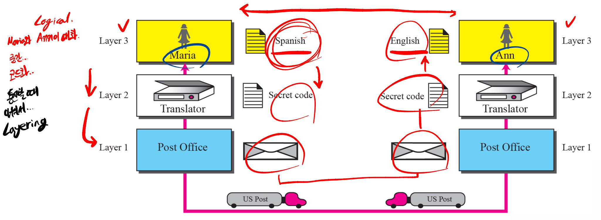
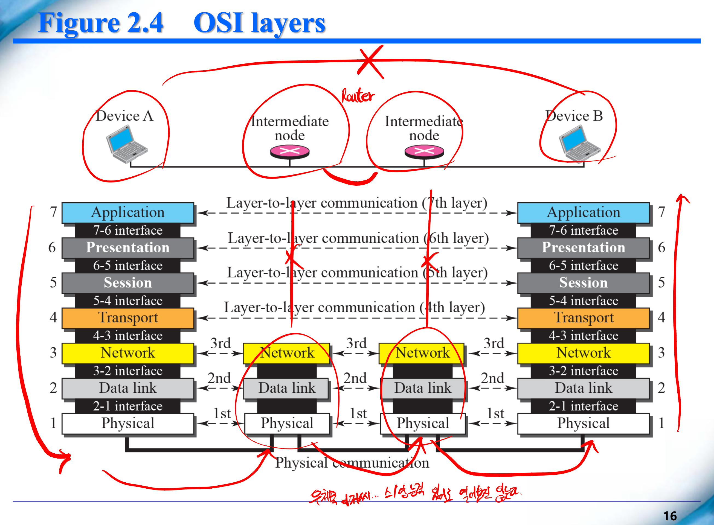
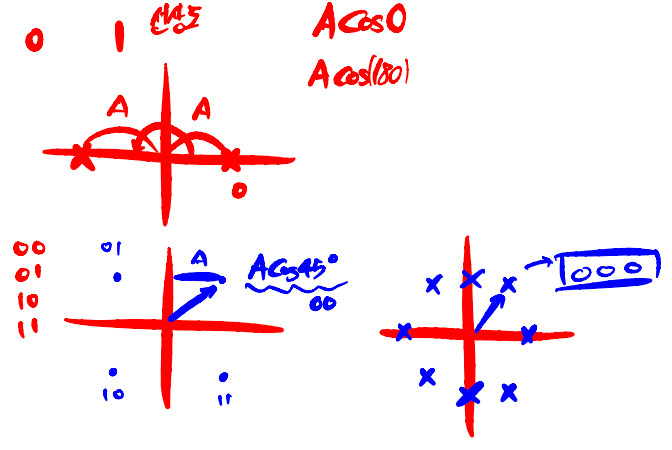
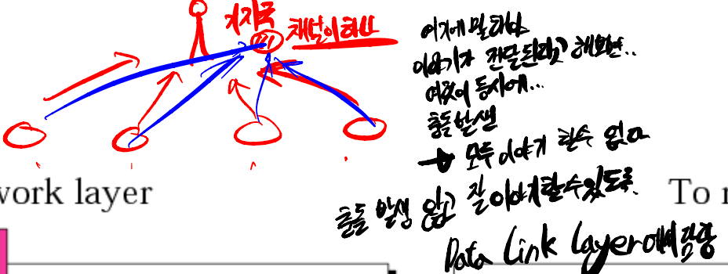
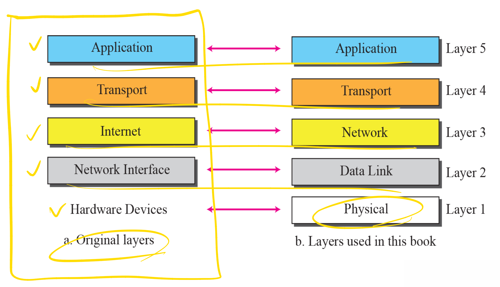
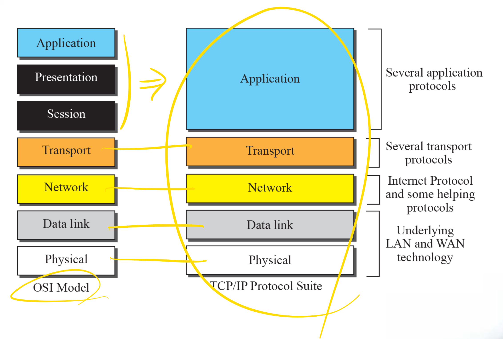

<h1>Chapter 2</h1>
<h2>The OSI Model and the TCP/IP Protocl Suite</h2>

<h3>2.1 Protocol Layers</h3>

<h3>Components</h3>

<h3>Example 2.1</h3>

<h3>Example 2.2</h3>

- Logical
    - Maria와 Ann이 대화
    - 중간 부분을 코드화 ..
    - 통신할 때 나눠서 처리한다 .. Layering ..

<h3>2.2 The OSI Model</h3>

- Layer 7 : Application
- Layer 6 : Presentation
- Layer 5 : Session
- Layer 4 : Transport
- Layer 3 : Network
- Layer 2 : Data link
- Layer 1 : Physical

<h3>Figure 2.4 OSI layers</h3>

- 우체국 아저씨 : 스페인어랑 영어를 할 수 있다고 하더라도 편지를 열어보진 않기 때문에 다른 레이어 관련된 무언가가 필요하지 않다.

<h3>Figure 2.5 An exchange using the OSI model</h3>

- 실제 데이터가 D7이라고 했을 때, 각 Layer에서 할 수 있는 일들을 Header에 담아서 전달한다.
- 해당 레이어에서의 데이터와 Header까지를 묶어서 다음 Layer의 데이터로 전달한다.
- 헤더의 경우 다른 Layer의 헤더에는 관심을 갖지 않는다.
- D2의 경우에는 Tail도 붙이긴 하는데 이 부분에 대해서는 나중에 추가로 알아보도록 하자.
- 사실 D2를 보내는데 보낼 때는 엄청나게 많은 양을 보내게 된다. 효율적일까 비효율적일까? 당연히 매우 비효율적이다. 하지만 이러한 것은 Layering을 위해 필요한 작업이다. 다른 Layer에서 뭔가 문제가 발생할 경우에도 맨 위에서 실제로 전달되는 내용이 바뀌거나 그러지 않기 때문이다. (이 부분 다시 한번 체크해보면 좋을 듯?) 문제가 없긴 하지만, 주고받는 데이터의 양이 많아지긴 한다.

<h3>Layers in the OSI Model</h3>

- Physical Layer
    - 비트 전송에 관심이 있는 레이어
    - 비트의 형태로 전송을 한다.
    - Physical characteristics of interfaces and media
    - Representation of bits (encoding)
    - Data rate
        - 얼마나 빨리 전송하냐? 얼마나 느리게 전송하냐?
        - 순서대로 잘 받아야 한다.
        - 싱크가 맞지 않는다면 순서가 바뀌게 된다.
    - Synchronization of bits (clock synchronization)
    - Line configuration (point-to-point, multipoint configuration)
    
    - Physical topology (mesh, star, ring, and bus topologies)
        - 하나의 버스 .. 충돌이 발생하는 경우 .. 많은 방식이 있을 수 있으나..
        - 전달하고 있는지 아닌지 체크 후 전달
        - 비트 .. Physical Layer
    - Transmission mode (simple, half-duplex, and full-duplex modes)
        - half-duplex
            - 말하고 듣고 동시에 안 됨
            - 무전기
        - full-duplex
            - 말하고 듣고 가능, 채널 2개
            - 전화
- Data Link Layer
    - Framing (frame : data unit)
        - 001101101 : 하나의 덩어리로 만들기
        - 주소 : Physical 주소 : 물리 주소
    - Physical addressing
        - 선상도
        
        - Header
            - 어떤 녀석이야~~ 하는 정보를 제공
            - 잘 도착하면 에러 잇고 없고 체크 가능
            - 에러가 있다면 다시 보내줘
            
    - Flow control (Hop-to-Hop control)
        - 잘못된 게 있다면 멈추고 다시 보내야 함 : 멈춘다 : flow control
    - Error control (using trailer)
    - Access control (determine which device has control over the link at any given time)
    - 기지국에 말해야 이야기가 전달된다고 해보자. 이런 경우 여럿이 동시에 말하는 경우 충돌이 발생하게 되고, 모두 이야기 할 수 없다. 충돌 발생 않고 잘 이야기 할 수 있도록 Data Link Layer에서 이러한 작업을 담당하고 있다.

    
     
- Network Layer : 길
    - Logical addressing
    - Routing
    - IP(Internet protocol)
    - 한 학기 동안 자세하게 배울 것 ..
    - 컴퓨터 자체의 주소 : Physical Address : 물리 주소
    - 접속한 위치에 따른 주소 : Logical Address : IP
- Transport Layer
    - Service-port addressing (port address)
    - Segmentation and reassembly (include numbering)
        - 데이터 길 경우 쪼개야 한다.
        - 쪼갠 데이터를 다 받은 경우 순서대로 다시 연결해주어야 한다.
    - Connection control (connectionless(UDP) and connection-oriented(TCP, SCTP))
        - connectionless
            - 한 번 데이터 보내면 연결 끊기는 것
        - connection-oriented(TCP, SCTP)
            - 한 번 데이터 보내게 되면 데이터 전송이 다 끝나기 전까지 계속 유지되는 것
            - 인터넷 .. 업로드 .. 다운로드 ..
            
            <t/>

    - Flow control (for End-to-End control)
    - Error control (using retransmission generally, for End-to-End control)
        - Flow control과 Error control은 Data Link Layer에서도, 여기에서도
- Session Layer : 연결관계
        - Session 연결 ..
    - Dialog control (half-duplex or full-duplex mode)
    - Synchronization (using checkpoint)
        - Naver에서 로그인하고 이메일로 들어갔을 때 .. 세션 유지되어야 한다.
        - 세션을 적용시키지 않고 데이터를 주소에 담게 된다면 주소가 유출될 경우 다른 사람들이 내 메일을 볼 수 있다.
        - 하지만 세션을 적용시킨다면 주소를 복붙하더라도 세션에 대한 정보가 존재하지 않기 때문에 다른 사람들이 내 메일을 볼 수 없다.
- Presentation Layer
    - Translation (change the information to a common format)
    - Encryption (and Decryption) / Encoding (and Decoding)
    - Compression (reduces the number of bits)
- Application Layer
    - Network virtual terminal (allows a user to log on to a remote host)
    - FTAM : file transfer, access, and management (for remote control)
    - E-mail service (X.400) : 프로그램 설치하게 되면 거기에 해당하는 동작 개념이 있어야 한다.
    - Directory service (X.500)

<h3>2.3 TCP/IP Protocol Suite</h3>

- The TCP/IP protocol suite is made of five layers:
    - physical, data link, network, transport, and application

<h3>Figure 2.7 Layers in the TCP/IP Protocol Suite</h3>

<h3>Figure 2.8 TCP/IP and OSI model</h3>

